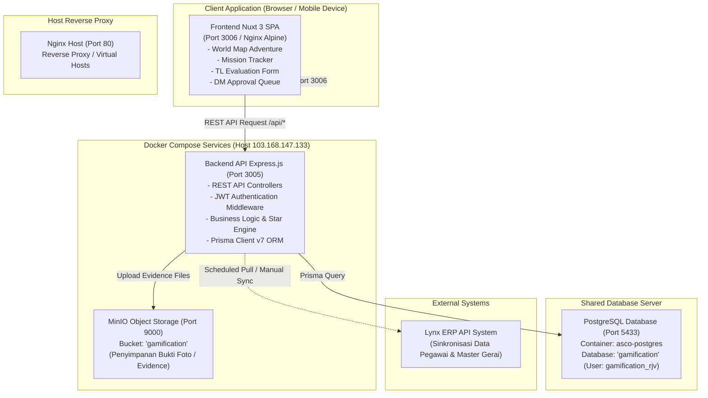
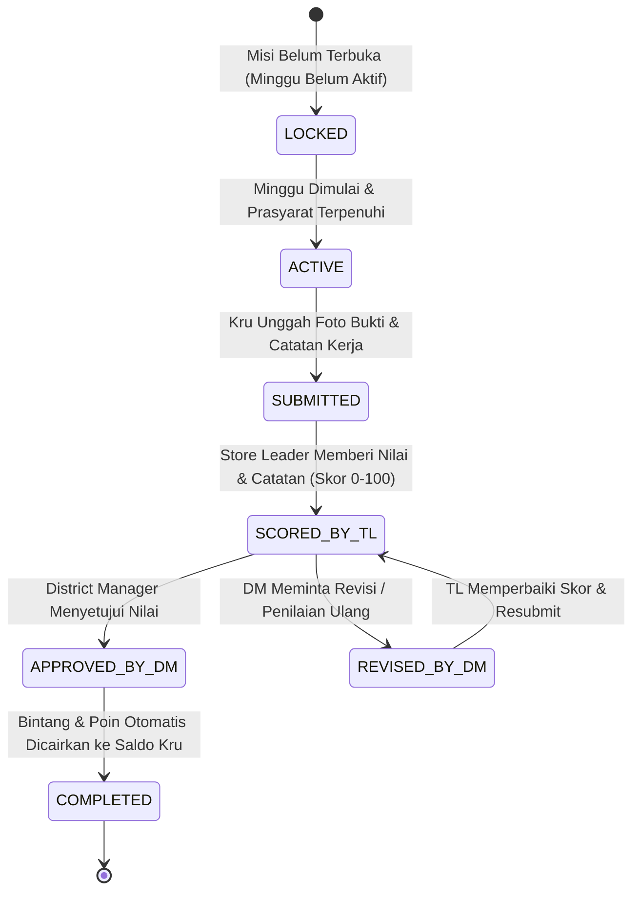
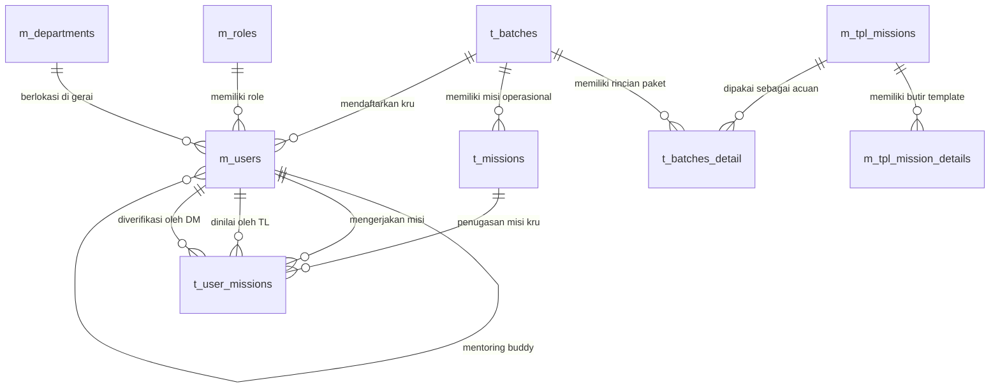

# SYSTEM ARCHITECTURE & SPECIFICATION BLUEPRINT
## Re.juve Gamification Mission Management System
**Dokumen Spesifikasi Teknis, Desain Arsitektur, dan Standar Kebutuhan Sistem**

---

## 📑 DAFTAR ISI
1. [Ringkasan Eksekutif & Tujuan Proyek](#1-ringkasan-eksekutif--tujuan-proyek)
2. [Target Pengguna & Analisis Persona](#2-target-pengguna--analisis-persona)
3. [Arsitektur Sistem Tingkat Tinggi (High-Level Architecture)](#3-arsitektur-sistem-tingkat-tinggi)
4. [Logika Bisnis & Mekanisme Gamifikasi (Game Mechanics)](#4-logika-bisnis--mekanisme-gamifikasi)
5. [Daftar User Stories & Acceptance Criteria](#5-daftar-user-stories--acceptance-criteria)
6. [Matriks Functional Requirements (FR)](#6-matriks-functional-requirements-fr)
7. [Non-Functional Requirements (NFR)](#7-non-functional-requirements-nfr)
8. [Struktur Basis Data & Entity Relationship Diagram (ERD)](#8-struktur-basis-data--entity-relationship-diagram-erd)
9. [Spesifikasi Integrasi & API Endpoints](#9-spesifikasi-integrasi--api-endpoints)
10. [Topologi Infrastruktur & Deployment](#10-topologi-infrastruktur--deployment)
11. [Rencana Rilis & Prioritas Scope (Roadmap)](#11-rencana-rilis--prioritas-scope-roadmap)

---

## 1. RINGKASAN EKSEKUTIF & TUJUAN PROYEK

### 1.1 Latar Belakang
Operasional gerai retail F&B Re.juve menuntut standar kualitas (*Standard Operating Procedure* / SOP) yang sangat ketat dalam penanganan produk *cold-pressed juice*, pelayanan pelanggan, kebersihan sanitasi, hingga pelaporan harian. Proses pelatihan dan orientasi kru baru (*New Hire Onboarding*) yang sebelumnya dilakukan secara konvensional dan manual sering menghadapi tantangan:
- Tingkat keterlibatan (*engagement*) kru baru yang kurang optimal.
- Pantauan kemajuan belajar harian/mingguan yang sulit dimonitor secara terpusat oleh Store Leader maupun District Manager.
- Penilaian kompetensi yang kurang terstandardisasi dan lambat dalam proses persetujuan manajerial.

### 1.2 Tujuan Proyek
Platform **Re.juve Gamification Mission Management System** hadir sebagai solusi berbasis gamifikasi perusahaan (*Enterprise Gamification*) yang bertujuan untuk:
1. **Mentransformasi Orientasi Kru**: Mengubah kurikulum SOP dan pelatihan menjadi rangkaian misi operasional interaktif bertema petualangan kepulauan (*Adventure World Map*).
2. **Standardisasi Pelatihan Berjenjang**: Menerapkan program terstruktur melalui program pra-batch (*Buddy 3 Hari*) dan batch misi mingguan (3, 4, atau 5 minggu).
3. **Akuntabilitas & Validasi Bertingkat**: Memfasilitasi penilaian terpadu oleh Store Leader (TL) dan validasi persetujuan oleh District Manager (DM) secara digital dengan rumus pembagian skor transparan.
4. **Meningkatkan Motivasi & Retensi**: Mengintegrasikan sistem reward bintang (*Stars*), poin, level pangkat (*Novice* hingga *Star Legend*), serta leaderboard performa antar gerai.

---

## 2. TARGET PENGGUNA & ANALISIS PERSONA

| Peran (Role) | Kode Sistem | Tanggung Jawab Utama | Kebutuhan Antarmuka |
| :--- | :---: | :--- | :--- |
| **Kru Baru (New Hire Crew)** | `CREW` | Menjalankan misi harian/mingguan, mengunggah bukti kerja foto/catatan, mengisi survei feedback onboarding, dan memantau peringkat bintang. | Tampilan mobile-first yang responsif, visual peta petualangan interaktif (*Adventure World Map*), pelacak progres misi, dan leaderboard. |
| **Store Leader / Buddy (TL)** | `SL` / `STORE_LEADER` | Membimbing kru di gerai, mengevaluasi 7 pilar rapor new hire (program Buddy), memberi skor misi kru (skala 0-100), dan mengajukan hasil penilaian ke DM. | Form penilaian kriteria berbasis slider dinamis, review foto bukti, dashboard pemantauan kru per batch gerai. |
| **District Manager (DM)** | `DM` / `DISTRICT_MANAGER` | Memonitor performa seluruh gerai di bawah wilayah supervisinya, menyetujui secara massal (*bulk approval*) atau meminta revisi atas penilaian TL. | Halaman Approval antrean cepat, perbandingan nilai TL vs DM, filter gerai & batch terpadu, modul audit per gerai. |
| **Superadmin / HR Ops** | `ADMIN` | Mengelola data master (gerai, paket SOP template, user/kru), mengonfigurasi batch gerai baru, memantau log sinkronisasi Lynx ERP, dan pengaturan parameter global. | Dashboard analitik komprehensif, CRUD template paket SOP, manajemen pengguna, import/export data, dan log audit sistem. |

---

## 3. ARSITEKTUR SISTEM TINGKAT TINGGI

Sistem menggunakan arsitektur modern berbasis micro-frontend/SPA dan REST API backend yang dikemas dalam Docker container terisolasi:



### Komponen Teknis Utama:
- **Frontend**: Nuxt 3 (Mode SPA, `ssr: false`), Tailwind CSS, Pinia Store Management, VueUse, Lucide Icons, Reka UI.
- **Backend**: Node.js 20, Express.js REST Framework, Prisma ORM v7, MinIO SDK, Swagger-UI OpenAPI 3.0.
- **Database**: PostgreSQL 16 (skema relasional terstruktur dengan UUIDv4).
- **File Storage**: MinIO S3 Object Storage dengan mekanisme auto-fallback ke direktori lokal `/uploads/evidence` jika server S3 offline.
- **Containerization**: Docker Compose (`gamification-backend` di `:3005` & `gamification-frontend` di `:3006`).

---

## 4. LOGIKA BISNIS & MEKANISME GAMIFIKASI

### 4.1 Program Pra-Batch: Buddy Onboarding (3 Hari Pertama)
Sebelum kru dilepas ke batch misi reguler, kru baru wajib menjalani pendampingan intensif bersama Store Leader (Buddy) selama 3 hari:
- **7 Pilar Kompetensi Standar Re.juve**:
  1. *Product Knowledge* (Pemahaman varian jus, bahan baku murni, manfaat nutrisi).
  2. *Food Safety & Hygiene* (Standar cuci tangan, sanitasi alat, penanganan suhu).
  3. *Customer Service Excellence* (Salam hangat, *hospitality*, penanganan komplain).
  4. *Cashier & POS Handling* (Ketelitian transaksi, pembayaran EDC/QRIS, struk).
  5. *Bar & Kitchen Workflow* (Alur persiapan bahan, peracikan sesuai takaran SOP).
  6. *Store Cleanliness & Grooming* (Kerapihan seragam, kebersihan display dan lantai).
  7. *Teamwork & Discipline* (Kedisiplinan shift, komunikasi aktif antar rekan kerja).
- **Rekomendasi Akhir**: Store Leader menentukan apakah kru **Siap Masuk Batch Reguler** atau memerlukan pembinaan lanjutan (tanpa memerlukan approval DM).

---

### 4.2 Batch Misi Operasional Reguler (Multi-Durasi: 3, 4, atau 5 Minggu)
Sistem mendukung konfigurasi durasi batch dinamis mengikuti kalender operasional:
- **Batch 3 Minggu (Batch Alpha)**: 12 Misi (4 misi/minggu) $\rightarrow$ Fast-track onboarding.
- **Batch 4 Minggu (Batch Beta)**: 16 Misi (4 misi/minggu) $\rightarrow$ Standar umum gerai mall.
- **Batch 5 Minggu (Batch Gamma)**: 20 Misi (4 misi/minggu) $\rightarrow$ Comprehensive flagship onboarding.

#### Aturan Penguncian Mingguan (Week-Lock & Progress Gating):
- Minggu ke-N hanya dapat diakses jika tanggal mulai minggu tersebut telah tiba DAN misi pada minggu sebelumnya telah diselesaikan.
- Misi dalam minggu aktif dapat dikerjakan secara paralel atau berurutan sesuai kategori (*Technical, Soft Skill, Leadership, Project*).

---

### 4.3 Siklus Hidup Misi (Mission Lifecycle State Machine)



---

### 4.4 Formula Perhitungan Bintang, Skor, dan Pangkat (Star Mechanics)

#### A. Skor Akhir Terpadu (Store Leader + District Manager):
Jika District Manager melakukan penyesuaian skor mandiri, nilai akhir dihitung berdasarkan rata-rata:
$$\text{Final Score} = \frac{\text{Skor TL} + \text{Skor DM}}{2}$$
*(Jika DM menyetujui langsung tanpa mengubah skor, maka Final Score = Skor TL).*

#### B. Konversi Nilai ke Bintang:
$$\text{Stars} = \min\left(5.0, \max\left(0, \text{round}\left(\frac{\text{Final Score}}{20}, 1\right)\right)\right)$$

| Rentang Skor | Konversi Bintang | Predikat Kinerja |
| :---: | :---: | :--- |
| **90.0 - 100.0** | ⭐⭐⭐⭐⭐ (5.0 Bintang) | *Outstanding / Sempurna* |
| **80.0 - 89.9** | ⭐⭐⭐⭐ (4.0 - 4.4 Bintang) | *Very Good / Di Atas Standar* |
| **70.0 - 79.9** | ⭐⭐⭐ (3.5 - 3.9 Bintang) | *Good / Memenuhi Standar* |
| **60.0 - 69.9** | ⭐⭐ (3.0 - 3.4 Bintang) | *Needs Improvement / Perlu Bimbingan* |
| **< 60.0** | ⭐ (1.0 - 2.9 Bintang) | *Under Standard / Wajib Evaluasi Ulang* |

#### C. Konversi Bintang ke Poin Reward:
$$\text{Poin Reward} = \text{Stars} \times 20$$
*(Contoh: 4.5 Bintang menghasilkan 90 Poin Reward untuk klaim reward atau leaderboard).*

#### D. Ambang Batas Pangkat Kru (10 Level Progresi):
```text
Level 1  → 0 Bintang        (Novice Crew)
Level 2  → 100 Bintang      (Apprentice Specialist)
Level 3  → 250 Bintang      (Field Operator)
Level 4  → 500 Bintang      (Senior Operator)
Level 5  → 800 Bintang      (Rising Star)
Level 6  → 1,200 Bintang    (Master Specialist)
Level 7  → 1,500 Bintang    (Elite Inspector)
Level 8  → 2,000 Bintang    (Operations Veteran)
Level 9  → 2,500 Bintang    (Grandmaster)
Level 10 → 3,500 Bintang    (Star Legend)
```

---

## 5. DAFTAR USER STORIES & ACCEPTANCE CRITERIA

### US-01: Autentikasi Pengguna & Identifikasi Peran (RBAC)
- **Sebagai** Pengguna Sistem (Kru, TL, DM, Admin),
- **Saya ingin** melakukan login menggunakan kredensial email & password atau quick persona selector,
- **Supaya** sistem mengenali peran saya dan menyajikan menu serta hak akses yang sesuai.
- **Acceptance Criteria**:
  - [x] Input email dan password divalidasi dan menghasilkan JWT Token jika valid.
  - [x] Kru langsung diarahkan ke Dashboard/Journey Map batch aktifnya.
  - [x] Store Leader melihat menu Evaluasi Kru dan Penilaian Buddy (hanya jika `isBuddy: true`).
  - [x] District Manager melihat menu antrean Approvals dan Leaderboard wilayahnya, dan terisolasi dari form penilaian kru.
  - [x] Akses route yang tidak sesuai role dicegah secara otomatis oleh global router middleware.

### US-02: Peta Petualangan Kru (Adventure World Map Journey)
- **Sebagai** Kru Baru (New Hire),
- **Saya ingin** melihat peta interaktif kepulauan gamifikasi yang menampilkan posisi pion karakter saya,
- **Supaya** saya mengetahui misi mana yang sedang aktif, yang terkunci, dan yang telah selesai.
- **Acceptance Criteria**:
  - [x] Node misi memiliki status visual yang jelas: *Terkunci (Abu-abu)*, *Aktif (Kuning/Animasi)*, *Menunggu Review (Biru)*, dan *Selesai (Hijau/Bintang)*.
  - [x] Mengklik node misi yang aktif membuka dialog detail misi dan checklist SOP.
  - [x] Posisi pion avatar kru otomatis berada di node misi aktif terkini.

### US-03: Penyerahan Bukti Pelaksanaan Misi (Evidence Submission)
- **Sebagai** Kru Baru,
- **Saya ingin** mengunggah foto bukti kerja dan catatan deskripsi hasil pelaksanaan misi,
- **Supaya** Store Leader dapat memvalidasi dan menilai hasil kerja saya.
- **Acceptance Criteria**:
  - [x] Kru dapat mengunggah file foto (JPEG, PNG) maksimal 5 MB atau memasukkan input checklist.
  - [x] Catatan teks deskripsi wajib diisi sebelum menekan tombol Submit.
  - [x] Setelah submit, status misi berubah dari `ACTIVE` menjadi `SUBMITTED`, dan tombol upload terkunci.

### US-04: Evaluasi Kinerja Misi oleh Store Leader
- **Sebagai** Store Leader,
- **Saya ingin** melihat daftar kiriman bukti kru, memeriksa foto kerja, dan memberikan skor (0-100) serta feedback,
- **Supaya** hasil evaluasi dapat diteruskan ke District Manager untuk persetujuan akhir.
- **Acceptance Criteria**:
  - [x] Form penilaian menyediakan slider nilai presisi (0-100) dan kolom catatan evaluasi.
  - [x] Tersedia fitur pratinjau (*preview*) foto bukti yang diunggah kru.
  - [x] Menyimpan penilaian mengubah status misi menjadi `PENDING_REVIEW` / `SCORED_BY_TL` dan mengirimkan antrean ke DM.

### US-05: Persetujuan Massal & Permintaan Revisi oleh District Manager
- **Sebagai** District Manager,
- **Saya ingin** meninjau antrean hasil penilaian dari Store Leader dan menyetujuinya secara massal (*bulk approve*) atau meminta revisi,
- **Supaya** proses persetujuan berlangsung efisien tanpa mengorbankan akurasi standar mutu.
- **Acceptance Criteria**:
  - [x] DM dapat memilih beberapa misi sekaligus dengan *checkbox* dan mengeksekusi "Setujui Terpilih".
  - [x] Saat di-approve, sistem langsung mencairkan bintang dan poin ke saldo kru secara realtime.
  - [x] Jika memilih "Minta Revisi", DM wajib mengisi alasan revisi dan status berubah menjadi `REVISION_REQUIRED`.

### US-06: Evaluasi Program Buddy (Rapor 7 Pilar New Hire)
- **Sebagai** Store Leader Buddy,
- **Saya ingin** mengisi formulir penilaian harian (Hari 1, 2, dan 3) mencakup 7 pilar kompetensi Re.juve,
- **Supaya** kru baru memperoleh bimbingan terarah dan dinyatakan siap masuk ke batch operasional.
- **Acceptance Criteria**:
  - [x] Tersedia 7 butir pilar kompetensi dengan skala penilaian standar.
  - [x] Store Leader dapat memilih tombol rekomendasi: "Rekomendasikan Masuk Batch" atau "Perlu Pendampingan Tambahan".
  - [x] Hasil evaluasi Buddy tersimpan langsung tanpa memerlukan approval DM.

### US-07: Master Template Paket SOP & Batch Builder
- **Sebagai** Superadmin,
- **Saya ingin** mengelola paket master misi (membuat, menyalin, mengedit checklist SOP) dan menugaskannya ke batch gerai,
- **Supaya** materi pelatihan selalu terpusat, konsisten, dan mudah disalin ke gerai baru.
- **Acceptance Criteria**:
  - [x] Admin dapat menduplikasi paket template master yang sudah ada dalam 1 klik.
  - [x] Membuat batch baru otomatis men-generate seluruh butir misi dari template yang dipilih.
  - [x] Perubahan pada template master tidak merusak data batch historis yang sudah berjalan.

---

## 6. MATRIKS FUNCTIONAL REQUIREMENTS (FR)

| Kode FR | Modul | Deskripsi Kebutuhan Fungsional | Prioritas |
| :--- | :--- | :--- | :---: |
| **FR-AUTH-01** | Autentikasi | Autentikasi pengguna berbasis JWT Token dengan masa berlaku 7 hari. | **MVP** |
| **FR-AUTH-02** | Autentikasi | Quick login persona switch (Demo Mode) untuk 8 akun representatif. | **MVP** |
| **FR-AUTH-03** | Autentikasi | Role-Based Access Control (RBAC) membatasi akses URL dan komponen UI. | **MVP** |
| **FR-JOUR-01** | Gamifikasi | Visualisasi peta petualangan (*World Map Journey*) adaptif multi-durasi (12, 16, 20 node). | **MVP** |
| **FR-JOUR-02** | Gamifikasi | Animasi pergerakan pion kru ke node misi aktif terkini. | **MVP** |
| **FR-MISS-01** | Misi | Katalog misi terfilter berdasarkan minggu berjalan dan status pengerjaan. | **MVP** |
| **FR-MISS-02** | Misi | Upload bukti foto kerja ke MinIO Storage atau fallback local disk. | **MVP** |
| **FR-MISS-03** | Misi | Checklist butir SOP yang wajib dicentang sebelum penyerahan misi. | **MVP** |
| **FR-EVAL-01** | Evaluasi TL | Form input evaluasi Store Leader dengan slider skor (0-100) dan kalkulasi bintang live. | **MVP** |
| **FR-EVAL-02** | Evaluasi TL | Catatan pembinaan (*coaching notes*) per butir misi yang dinilai. | **MVP** |
| **FR-APPR-01** | Approval DM | Antrean persetujuan interaktif dengan tabel data dan filter per gerai/batch. | **MVP** |
| **FR-APPR-02** | Approval DM | Bulk Approval (Persetujuan Massal) dalam satu kali konfirmasi. | **MVP** |
| **FR-APPR-03** | Approval DM | Modal permintaan revisi dengan input alasan wajib bagi Store Leader. | **MVP** |
| **FR-BUDD-01** | Program Buddy | Form evaluasi 3 hari pra-batch mencakup 7 pilar kompetensi onboarding Re.juve. | **MVP** |
| **FR-BUDD-02** | Program Buddy | Validasi hak akses: Menu Buddy hanya aktif bagi user dengan atribut `isBuddy: true`. | **MVP** |
| **FR-MAST-01** | Master Data | Manajemen Master Gerai (*Department*) terhubung ke Store Leader dan District Manager. | **MVP** |
| **FR-MAST-02** | Master Data | Manajemen Master Template Paket SOP (Journey, Buddy, Feedback). | **MVP** |
| **FR-MAST-03** | Master Data | Generator Batch otomatis mengkloning butir misi dari template master ke gerai. | **MVP** |
| **FR-FEED-01** | Feedback Kru | Kuesioner evaluasi onboarding 17 butir pertanyaan terstandarisasi. | **MVP** |
| **FR-LEAD-01** | Leaderboard | Peringkat akumulasi bintang kru dan rerata gerai secara realtime. | **MVP** |
| **FR-SYNC-01** | Lynx ERP | Endpoint sinkronisasi data master karyawan dan gerai dari ERP Lynx. | **Phase 2** |

---

## 7. NON-FUNCTIONAL REQUIREMENTS (NFR)

| Kode NFR | Kategori | Parameter Kinerja / Spesifikasi Teknis |
| :--- | :--- | :--- |
| **NFR-PERF-01** | Performa Frontend | First Contentful Paint (FCP) < 1.5 detik pada jaringan 4G standar. |
| **NFR-PERF-02** | Performa Backend | Waktu respon rata-rata REST API (P95) < 300 ms untuk transaksi standar. |
| **NFR-PERF-03** | Efisiensi Memori | Frontend SPA di Nginx Alpine menggunakan RAM < 25 MB di server host. |
| **NFR-SEC-01** | Keamanan Data | Password di-hash menggunakan algoritma Bcrypt (salt rounds: 10). |
| **NFR-SEC-02** | Keamanan Transport | Semua komunikasi API via HTTPS atau port internal terproteksi. |
| **NFR-SEC-03** | Perlindungan Host | Container Docker berjalan dalam user non-root dan jaringan terisolasi (`rejuve-gamification_default`). |
| **NFR-REL-01** | Ketersediaan | Fallback penyimpanan bukti: Jika MinIO offline, sistem otomatis menyimpan ke local storage tanpa melempar error 500 ke pengguna. |
| **NFR-REL-02** | Integritas Data | Transaksi approval dan minting bintang dijalankan dalam atomic database transaction (Prisma `$transaction`). |
| **NFR-COMP-01** | Kompatibilitas | Mendukung browser modern (Chrome, Safari iOS, Edge, Firefox) dan responsif pada layar ponsel 360px hingga desktop 4K. |
| **NFR-QUAL-01** | Kualitas Kode | **Wajib 100% Lulus Pengujian Unit Test (0 fail, 0 error)** sebelum proses build dan deployment diizinkan berjalan. |

---

## 8. STRUKTUR BASIS DATA & ENTITY RELATIONSHIP DIAGRAM (ERD)



### Kamus Data Tabel Utama:

#### 1. `m_users` (Pengguna & Kru Gamifikasi)
- `user_id` (UUID, PK): Identifier unik pengguna.
- `name` (VARCHAR): Nama lengkap karyawan.
- `email` (VARCHAR, Unique): Alamat email korporat/login.
- `password` (VARCHAR): Hash password (Bcrypt).
- `role_id` (UUID, FK ke `m_roles`): Peran pengguna (`CREW`, `SL`, `DM`, `ADMIN`).
- `stars` (FLOAT, Default 0): Total akumulasi bintang yang dikumpulkan.
- `points` (FLOAT, Default 0): Total poin reward aktif.
- `level` (INT, Default 1): Tingkat pangkat gamifikasi (1 s/d 10).
- `department_id` (UUID, FK ke `m_departments`): Gerai penempatan aktual.
- `batch_id` (UUID, FK ke `t_batches`): Batch orientasi yang sedang diikuti.
- `is_buddy` (BOOLEAN, Default false): Flag penugasan sebagai Store Leader Buddy.
- `user_buddy_id` (UUID, FK self ke `m_users`): Penugasan mentor buddy untuk kru baru.

#### 2. `t_batches` (Periode Batch Gerai)
- `batch_id` (UUID, PK): Identifier unik batch.
- `code` (VARCHAR, Unique): Kode batch (misal: `BATCH-2026-GI-01`).
- `name` (VARCHAR): Nama batch (misal: `Batch 1 - Grand Indonesia`).
- `status` (ENUM: `DRAFT`, `OPEN`, `CLOSE`): Status operasional batch.
- `start_date` & `end_date` (DATE): Periode kalender pelaksanaan batch.
- `current_week` (INT): Indikator minggu berjalan (1 s/d 5).

#### 3. `t_missions` (Katalog Misi per Batch)
- `mission_id` (UUID, PK): Identifier butir misi.
- `batch_id` (UUID, FK ke `t_batches`): Batch pemilik misi.
- `week_or_day_number` (INT): Penanda minggu (1-5) atau hari pra-batch (1-3).
- `mission_title` (VARCHAR): Judul misi operasional SOP.
- `category` (ENUM: `TECHNICAL`, `SOFT_SKILL`, `LEADERSHIP`, `PROJECT`).
- `type` (ENUM: `JOURNEY`, `BUDDY`, `FEEDBACK`).
- `sop_checklist` (JSON): Butir-butir SOP yang wajib divalidasi.
- `scale_config` (JSON): Konfigurasi bobot kriteria penilaian.

#### 4. `t_user_missions` (Transaksi Eksekusi & Penilaian Misi)
- `user_mission_id` (UUID, PK): Identifier transaksi pengerjaan misi.
- `user_id` (UUID, FK ke `m_users`): Kru yang mengerjakan.
- `mission_id` (UUID, FK ke `t_missions`): Misi yang dikerjakan.
- `status` (ENUM: `LOCKED`, `ACTIVE`, `SUBMITTED`, `SCORED_BY_TL`, `APPROVED_BY_DM`, `REVISED_BY_DM`, `COMPLETED`).
- `evidence_url` (VARCHAR): Tautan URL foto bukti di MinIO/Local Storage.
- `submission_notes` (TEXT): Catatan/rangkuman kerja dari kru.
- `tl_id` (UUID, FK ke `m_users`): Store Leader penilai.
- `tl_score` (FLOAT, 0-100): Skor evaluasi Store Leader.
- `tl_notes` (TEXT): Feedback/catatan pembinaan dari Store Leader.
- `dm_id` (UUID, FK ke `m_users`): District Manager yang memverifikasi.
- `dm_score` (FLOAT, 0-100): Skor dari District Manager (opsional).
- `dm_notes` (TEXT): Catatan dari DM atau alasan revisi.
- `final_score` (FLOAT): Rerata nilai akhir `(TL + DM) / 2`.
- `stars` (FLOAT): Jumlah bintang yang dihasilkan (0.0 s/d 5.0).

---

## 9. SPESIFIKASI INTEGRASI & API ENDPOINTS

Dokumentasi interaktif OpenAPI 3.0 tersedia secara langsung di endpoint: `http://103.168.147.133:3005/swagger`.

### Ringkasan Endpoint Utama:
```text
AUTH:
  POST /api/auth/login             → Otentikasi & penerbitan JWT Token
  GET  /api/auth/me                → Data profil pengguna aktif & relasi batch
  POST /api/auth/change-password   → Pembaruan kata sandi

BATCHES & MISSIONS:
  GET  /api/batches                → Daftar batch gerai aktif
  GET  /api/batches/:id            → Detail batch, daftar kru, dan timeline minggu
  GET  /api/batches/:id/missions   → Daftar misi per minggu untuk batch terpilih
  POST /api/missions/:id/submit    → Kru mengunggah bukti foto & submit misi

EVALUATION & APPROVAL:
  POST /api/evaluations            → Store Leader menyimpan skor (0-100) & notes
  GET  /api/evaluations/approvals  → District Manager mengambil antrean review
  POST /api/evaluations/approve    → District Manager bulk approve misi
  POST /api/evaluations/revise     → District Manager meminta revisi ke TL

BUDDY & FEEDBACK:
  GET  /api/templates?type=BUDDY   → Memuat paket template 7 pilar Rapor New Hire
  POST /api/evaluations/buddy      → Menyimpan evaluasi harian Buddy 3 hari
  POST /api/evaluations/feedback   → Kru mengirim survei pengalaman onboarding (17 Q)

MASTER DATA & SYNC:
  GET  /api/masters/departments    → Master data gerai & penugasan SL/DM
  GET  /api/masters/users          → Direktori pengguna & pengaturan peran
  GET  /api/templates              → Master template SOP paket misi
  POST /api/sync/lynx              → Pemicu sinkronisasi data dengan ERP Lynx
```

---

## 10. TOPOLOGI INFRASTRUKTUR & DEPLOYMENT

### 10.1 Alokasi Port & Arsitektur Jaringan Host
Aplikasi dideploy pada **VPS Ubuntu 22.04 LTS (IP: `103.168.147.133`)** menggunakan Docker Compose berdampingan dengan ekosistem ASCO Microservices secara aman:

| Service | Port Host | Jaringan Docker | Peran & Akses |
| :--- | :---: | :--- | :--- |
| **`gamification-frontend`** | **`3006`** | `rejuve-gamification_default` | Web UI Nuxt 3 SPA (Nginx Alpine) |
| **`gamification-backend`** | **`3005`** | `rejuve-gamification_default` | REST API Server Express.js & Swagger |
| **`asco-postgres`** | **`5433`** | `asco_network` (via host gateway) | Shared DB Server (Database `gamification`) |
| **MinIO Storage** | **`9000`** | Internal / Local Storage | Penyimpanan foto bukti kerja |

### 10.2 Skrip Automasi 1-Baris di Server
- Update & Build Frontend: `/root/deploy-fe-gamification.sh`
- Update & Build Backend: `/root/deploy-be-gamification.sh`

### 10.3 Protokol Wajib Sebelum Deployment (SOP Quality Gate)
Sesuai **Rule 4** pada `AGENTS.md` dan **Rule 16** pada `docs/RULES.md`:
1. Pengujian unit test lokal wajib dijalankan:
   ```bash
   npm --prefix frontend run test
   ```
2. Persyaratan kelulusan: **100% PASS (0 Error, 0 Fail)** dari seluruh pengujian CRUD dan QA Test Suite.
3. Seluruh riwayat wajib dicatat ke dokumen [`docs/DEPLOYMENT_LOG.md`](file:///d:/Ikhsan/Kerjaan/Gamification-rejuve/docs/DEPLOYMENT_LOG.md).

---

## 11. RENCANA RILIS & PRIORITAS SCOPE (ROADMAP)

### Phase 1: MVP (Saat Ini Sudah Berjalan & Live di Server) 🟢
- [x] Sistem autentikasi RBAC 4 peran (Kru, TL, DM, Admin) dan quick persona switcher.
- [x] Peta petualangan interaktif *World Map Journey* dengan node dinamis multi-minggu.
- [x] Manajemen batch multi-durasi (3 Minggu / 12 Misi, 4 Minggu / 16 Misi, 5 Minggu / 20 Misi).
- [x] Pengunggahan bukti kerja foto dan catatan kru.
- [x] Form evaluasi Store Leader dengan slider skor presisi 0-100.
- [x] Antrean Approval District Manager dengan fitur *Bulk Approve* dan *Request Revision*.
- [x] Modul Onboarding Buddy 3 Hari & Rapor Kompetensi 7 Pilar Re.juve.
- [x] Kuesioner Feedback Onboarding 17 Butir Pertanyaan.
- [x] Leaderboard Gerai dan sistem progres level pangkat (Level 1-10).
- [x] Dockerization & Deployment di VPS Port 3005 (BE) dan Port 3006 (FE).
- [x] Buku Log Deployment resmi & integrasi automated unit testing.

### Phase 2: Enhanced Features (Tahap Pengembangan Selanjutnya) 🟡
- [ ] Push Notifications realtime via Socket.io saat misi diapprove atau direvisi.
- [ ] Subdomain Reverse Proxy Nginx (misal: `gamification.rejuve.co.id` mengarah ke port 3006/3005).
- [ ] Sinkronisasi otomatis terjadwal (*Scheduled Cron*) dengan API Lynx ERP.
- [ ] Modul Rewards Redemption (penukaran poin reward dengan voucher/merchandise).

### Phase 3: Long-term Innovations (Backlog) ⚪
- [ ] Aplikasi native mobile (PWA Offline-first support).
- [ ] AI-assisted Evidence Verification (verifikasi foto SOP otomatis menggunakan computer vision).
- [ ] Modul turnamen musiman antar wilayah gerai (*National Store Championship*).
