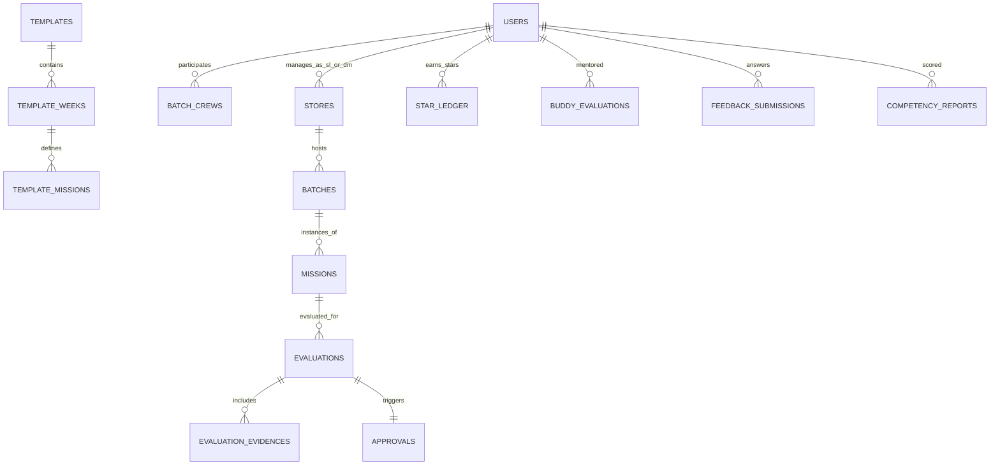

# Spesifikasi Lengkap REST API Backend: Re.juve Gamification & Onboarding System

Dokumen ini adalah **Kontrak API (REST API JSON Data Contract)** dan **Spesifikasi Database** resmi untuk tim Backend Developer (BE).

---

## 1. Standar Arsitektur API

* **Base URL**: `https://api.rejuve-gamification.com/api/v1`
* **Content-Type**: `application/json` (Kecuali endpoint upload file menggunakan `multipart/form-data`)
* **Autentikasi**: `Authorization: Bearer <JWT_TOKEN>` pada Header request
* **Format Waktu**: ISO-8601 UTC (`YYYY-MM-DDTHH:mm:ss.sssZ`)

### Standard Response Envelope (JSON)

#### Response Sukses (200 OK / 201 Created):
```json
{
  "success": true,
  "statusCode": 200,
  "message": "Operasi berhasil dieksekusi",
  "data": {},
  "meta": {
    "page": 1,
    "limit": 20,
    "total": 100,
    "totalPages": 5
  }
}
```

#### Response Error (400 Bad Request / 401 Unauthorized / 403 Forbidden / 404 Not Found / 500 Internal Error):
```json
{
  "success": false,
  "statusCode": 400,
  "error": "BAD_REQUEST",
  "message": "Validasi data gagal",
  "errors": [
    {
      "field": "score",
      "message": "Score harus berupa angka antara 0 hingga 100"
    }
  ]
}
```

---

## 2. Struktur Database & Entity Relationship Model



---

## 3. Matriks Hak Akses Peran (Role-Based Access Control / RBAC)

| Modul / Fitur | SUPER_ADMIN | DISTRICT_MANAGER (DM) | STORE_LEADER (SL) | CREW (Kru Barista) |
| :--- | :---: | :---: | :---: | :---: |
| **User & Gerai Management** | CRUD Full | Read Gerai Wilayah | Read Gerai Sendiri | Read Rekan 1 Gerai |
| **Template SOP Management** | CRUD Full | Read Only | Read Only | No Access |
| **Batch Gerai Management** | CRUD Full | CRUD Wilayah | Read Batch Gerai | Read Batch Sendiri |
| **Evaluasi Misi 1-per-1** | View All | View Wilayah | **Create / Update SL** | Read Progress Sendiri |
| **Persetujuan & Penyesuaian Nilai** | Override All | **Approve & Override DM** | Read Status | Read Disetujui |
| **Pencairan Bintang (Minting)** | Sistem Otomatis | **Trigger saat Approve** | Otomatis | Penerima Reward |
| **Gamification & Leaderboard** | Read All | Read Wilayah | Read Gerai | **Read & Play Journey** |
| **Buddy Program (3 Hari)** | CRUD Template | Read Rapor | **Evaluasi 3 Hari Kru** | Read Status Buddy |
| **Survei Feedback & Rapor** | Buat Pertanyaan | Read Analitik | **Isi Rapor 7 Pilar** | **Isi Survei 17 Butir** |

---

## 4. Rumus Bisnis & Aturan Perhitungan Otomatis

### A. Rumus Nilai Akhir Evaluasi (SL & DM)
$$\text{Final Score} = \text{Math.round}\left(\frac{\text{Skor SL} + \text{Skor DM}}{2}\right)$$
*Jika DM tidak mengubah nilai, maka $\text{Skor DM} = \text{Skor SL}$, sehingga $\text{Final Score} = \text{Skor SL}$.*

### B. Konversi Nilai ke Bintang (Star Reward Tier)
* Skor **90 – 100** $\rightarrow$ **5 Bintang (⭐ 5)** — *Sangat Memuaskan (Gold Master)*
* Skor **80 – 89** $\rightarrow$ **4 Bintang (⭐ 4)** — *Memenuhi Standar Unggul (Silver Pro)*
* Skor **70 – 79** $\rightarrow$ **3 Bintang (⭐ 3)** — *Cukup Sesuai SOP (Bronze)*
* Skor **60 – 69** $\rightarrow$ **2 Bintang (⭐ 2)** — *Perlu Perbaikan Ringan*
* Skor **50 – 59** $\rightarrow$ **1 Bintang (⭐ 1)** — *Perlu Bimbingan Ulang*
* Skor **0 – 49** $\rightarrow$ **0 Bintang (⭐ 0)** — *Tidak Memenuhi Syarat / Gagal*

---

## 5. Rincian Endpoint REST API

---

### 🔑 MODUL 1: AUTENTIKASI & PENGGUNA (`/auth` & `/users`)

#### 1.1. Login Multi-Peran
* **Method & URL**: `POST /api/v1/auth/login`
* **Request Body**:
```json
{
  "username": "andi.barista",
  "password": "Password123!"
}
```
* **Response (200 OK)**:
```json
{
  "success": true,
  "statusCode": 200,
  "message": "Login berhasil",
  "data": {
    "token": "eyJhbGciOiJIUzI1NiIsInR5cCI6IkpXVCJ9...",
    "expiresIn": 86400,
    "user": {
      "id": "crew-001",
      "username": "andi.barista",
      "name": "Andi Pratama",
      "email": "andi.pratama@rejuve.co.id",
      "role": "CREW",
      "position": "Senior Barista",
      "storeId": "store-gi-01",
      "storeName": "Grand Indonesia",
      "batchId": "batch-alpha",
      "avatar": "https://images.unsplash.com/photo-1535713875002-d1d0cf377fde?auto=format&fit=crop&w=150&q=80",
      "stars": 142,
      "level": 4,
      "rankTitle": "Master Barista",
      "badgeCount": 6
    }
  }
}
```

#### 1.2. Get Profil Pengguna Saat Ini
* **Method & URL**: `GET /api/v1/auth/me`
* **Headers**: `Authorization: Bearer <TOKEN>`

#### 1.3. CRUD Pengguna (Admin)
* `GET /api/v1/users?role=CREW&storeId=store-gi-01&page=1&limit=20`
* `POST /api/v1/users`
* `GET /api/v1/users/:id`
* `PUT /api/v1/users/:id`
* `DELETE /api/v1/users/:id`

---

### 🏬 MODUL 2: MASTER GERAI / STORE (`/stores`)

#### 2.1. List Semua Gerai
* **Method & URL**: `GET /api/v1/stores?region=DKI%20Jakarta&search=Grand`
* **Response (200 OK)**:
```json
{
  "success": true,
  "statusCode": 200,
  "data": [
    {
      "id": "store-gi-01",
      "code": "GI-01",
      "name": "Re.juve Grand Indonesia",
      "city": "Jakarta Pusat",
      "region": "DKI Jakarta",
      "address": "Grand Indonesia East Mall Lt. LG, Jl. M.H. Thamrin No.1",
      "storeLeader": {
        "id": "sl-001",
        "name": "Budi Santoso",
        "email": "budi.santoso@rejuve.co.id",
        "phone": "+62 812-3456-7890"
      },
      "districtManager": {
        "id": "dm-001",
        "name": "Hendra Wijaya",
        "email": "hendra.wijaya@rejuve.co.id",
        "phone": "+62 811-9876-5432"
      },
      "activeBatchId": "batch-alpha",
      "totalCrews": 6,
      "status": "ACTIVE",
      "createdAt": "2026-01-15T08:00:00Z"
    }
  ]
}
```

#### 2.2. Tambah Gerai Baru
* **Method & URL**: `POST /api/v1/stores`
* **Request Body**:
```json
{
  "code": "SBY-02",
  "name": "Re.juve Tunjungan Plaza 6",
  "city": "Surabaya",
  "region": "Jawa Timur",
  "address": "Tunjungan Plaza 6 Lt. 2, Jl. Embong Malang No. 21-31",
  "storeLeaderId": "sl-002",
  "districtManagerId": "dm-002",
  "capacity": 8
}
```

---

### 📦 MODUL 3: MASTER TEMPLATE SOP DINAMIS (`/templates`)

#### 3.1. List Template Paket (3, 4, 5 Minggu)
* **Method & URL**: `GET /api/v1/templates`
* **Response (200 OK)**:
```json
{
  "success": true,
  "statusCode": 200,
  "data": [
    {
      "id": "tpl-std-3w",
      "code": "TPL-3W-V1",
      "name": "Standard Onboarding (3 Minggu / 12 Misi)",
      "totalWeeks": 3,
      "totalMissions": 12,
      "category": "Standard Barista",
      "weeks": [
        {
          "weekNumber": 1,
          "title": "Kultur & Kebersihan Bar",
          "description": "Fondasi dasar higienitas dan pemahaman brand Re.juve",
          "missions": [
            {
              "code": "M-01",
              "title": "Standar Sanitasi Cold-Pressed Area",
              "category": "Kebersihan & Higienitas",
              "requirements": [
                "Cuci tangan 6 langkah WHO sebelum menyentuh buah",
                "Sanitasi pisau & talenan dengan food-grade sanitizer",
                "Cek suhu chiller penyimpanan buah (2°C - 6°C)"
              ],
              "maxScore": 100,
              "starReward": 5
            }
          ]
        }
      ]
    }
  ]
}
```

#### 3.2. Duplikasi Template Master
* **Method & URL**: `POST /api/v1/templates/:id/duplicate`
* **Request Body**:
```json
{
  "newCode": "TPL-4W-SPECIALTY",
  "newName": "Specialty Barista Express (4 Minggu)"
}
```

---

### 👥 MODUL 4: BATCH GERAI (`/batches`)

#### 4.1. Pembuatan Batch Baru
* **Method & URL**: `POST /api/v1/batches`
* **Request Body**:
```json
{
  "code": "BATCH-2026-09-GI",
  "name": "Batch 4 - Grand Indonesia",
  "storeId": "store-gi-01",
  "templateId": "tpl-std-4w",
  "startDate": "2026-09-01",
  "endDate": "2026-09-28",
  "crewIds": ["crew-001", "crew-002", "crew-003"]
}
```
*Aturan Backend: Sistem secara otomatis men-generate seluruh butir misi operasional untuk batch tersebut berdasarkan template yang dipilih.*

#### 4.2. Roster Kru & Progress Batch
* **Method & URL**: `GET /api/v1/batches/:id/progress`
* **Response (200 OK)**:
```json
{
  "success": true,
  "statusCode": 200,
  "data": {
    "batchId": "batch-alpha",
    "batchName": "Batch 1 - Grand Indonesia",
    "currentWeek": 2,
    "totalWeeks": 3,
    "overallProgress": 65,
    "crews": [
      {
        "crewId": "crew-001",
        "name": "Andi Pratama",
        "role": "Senior Barista",
        "avatar": "https://...",
        "weekEvaluatedCount": 4,
        "weekTotalMissions": 4,
        "status": "COMPLETED",
        "totalStarsEarned": 142
      }
    ]
  }
}
```

---

### 📝 MODUL 5: EVALUASI STORE LEADER (1-PER-1 MISI) (`/evaluations`)

#### 5.1. Upload Foto Bukti SOP Lapangan
* **Method & URL**: `POST /api/v1/evaluations/upload-evidence`
* **Content-Type**: `multipart/form-data`
* **Form Fields**:
  * `file`: (Binary File JPG/PNG/WebP, max 5MB)
  * `missionId`: `msn-w2-001`
  * `crewId`: `crew-001`
* **Response (201 Created)**:
```json
{
  "success": true,
  "statusCode": 201,
  "data": {
    "id": "ev-883921",
    "url": "https://storage.googleapis.com/rejuve-gamification/evidences/ev-883921.jpg",
    "caption": "Pemeriksaan Brix Jus Jeruk",
    "uploadedAt": "2026-09-01T10:30:00Z"
  }
}
```

#### 5.2. Kirim Evaluasi Mandiri Per-Misi (SL ke DM)
* **Method & URL**: `POST /api/v1/evaluations/submit-single`
* **Request Body**:
```json
{
  "batchId": "batch-alpha",
  "week": 2,
  "missionId": "msn-w2-001",
  "crewId": "crew-001",
  "slScore": 95,
  "comment": "Pemeriksaan rasa jus cold-pressed sangat segar dan takaran brix kemanisan buah presisi sesuai SOP.",
  "evidenceIds": ["ev-883921"]
}
```
* **Response (200 OK)**:
```json
{
  "success": true,
  "statusCode": 200,
  "message": "Misi berhasil dinilai dan diajukan ke District Manager",
  "data": {
    "evaluationId": "eval-001-c1",
    "approvalId": "appr-001",
    "status": "PENDING_REVIEW",
    "slScore": 95,
    "calculatedStars": 5,
    "submittedAt": "2026-09-01T10:35:00Z"
  }
}
```

---

### ⚡ MODUL 6: PERSETUJUAN & PENYESUAIAN NILAI DM (`/approvals`)

#### 6.1. List Antrean Persetujuan DM (POV 1 User 1 Misi)
* **Method & URL**: `GET /api/v1/approvals?storeId=store-gi-01&status=PENDING_REVIEW`
* **Response (200 OK)**:
```json
{
  "success": true,
  "statusCode": 200,
  "data": [
    {
      "id": "appr-001",
      "evaluationId": "eval-001-c1",
      "missionId": "msn-w2-001",
      "missionCode": "M-05",
      "missionTitle": "Cek Rasa & Kemanisan Alami Buah",
      "missionCategory": "Kualitas Produk",
      "week": 2,
      "batchId": "batch-alpha",
      "batchName": "Batch 1 - Grand Indonesia",
      "storeName": "Grand Indonesia",
      "supervisorId": "sl-001",
      "supervisorName": "Budi Santoso (Store Leader)",
      "crewId": "crew-001",
      "crewName": "Andi Pratama",
      "crewAvatar": "https://...",
      "crewRole": "Senior Barista",
      "slScore": 95,
      "dmScore": 95,
      "score": 95,
      "calculatedStars": 5,
      "status": "PENDING_REVIEW",
      "comment": "Pemeriksaan rasa jus cold-pressed sangat segar dan takaran brix presisi.",
      "evidenceList": [
        {
          "id": "ev-883921",
          "url": "https://images.unsplash.com/photo-1581092160607-ee22621dd758?auto=format&fit=crop&w=600&q=80",
          "caption": "Foto brix meter"
        }
      ],
      "submittedAt": "2026-09-01T10:35:00Z"
    }
  ]
}
```

#### 6.2. Setujui Misi Tunggal (Dengan Penyesuaian Skor DM)
* **Method & URL**: `POST /api/v1/approvals/:id/approve`
* **Request Body**:
```json
{
  "dmScore": 90,
  "dmNote": "Hasil uji coba konsisten baik. Sedikit catatan pada pembersihan wadah."
}
```
* **Logika Backend**:
  * $\text{finalScore} = \text{Math.round}((95 + 90) / 2) = 93$
  * $\text{calculatedStars} = 5$ (karena $93 \ge 90$)
  * Update status evaluasi & misi menjadi `COMPLETED` / `APPROVED`.
  * **Otomatis mencairkan +5 ⭐ ke saldo kru `crew-001`** dan mencatat ke tabel `star_ledger`.
* **Response (200 OK)**:
```json
{
  "success": true,
  "statusCode": 200,
  "message": "Evaluasi misi berhasil disetujui dan bintang telah dicairkan",
  "data": {
    "approvalId": "appr-001",
    "crewId": "crew-001",
    "crewName": "Andi Pratama",
    "slScore": 95,
    "dmScore": 90,
    "finalScore": 93,
    "awardedStars": 5,
    "status": "COMPLETED",
    "approvedAt": "2026-09-01T11:00:00Z"
  }
}
```

#### 6.3. Persetujuan Massal (Bulk Approve)
* **Method & URL**: `POST /api/v1/approvals/bulk-approve`
* **Request Body**:
```json
{
  "approvalIds": ["appr-001", "appr-002", "appr-003"]
}
```

---

### 🗺️ MODUL 7: GAMIFIKASI & ADVENTURE JOURNEY (`/gamification`)

#### 7.1. Get Node Peta Petualangan Kru (Adventure Map)
* **Method & URL**: `GET /api/v1/gamification/journey/:crewId?batchId=batch-alpha`
* **Response (200 OK)**:
```json
{
  "success": true,
  "statusCode": 200,
  "data": {
    "crew": {
      "id": "crew-001",
      "name": "Andi Pratama",
      "totalStars": 142,
      "level": 4,
      "rankTitle": "Master Barista",
      "currentMissionId": "msn-w2-003"
    },
    "nodes": [
      {
        "id": "node-1",
        "missionId": "msn-w1-001",
        "week": 1,
        "step": 1,
        "title": "Sanitasi Cold-Pressed Area",
        "status": "COMPLETED",
        "starsEarned": 5,
        "score": 95,
        "position": { "x": 20, "y": 80 }
      },
      {
        "id": "node-2",
        "missionId": "msn-w2-003",
        "week": 2,
        "step": 3,
        "title": "Mastering Cold-Pressed Recipes",
        "status": "IN_PROGRESS",
        "starsEarned": 0,
        "score": 0,
        "position": { "x": 50, "y": 50 }
      }
    ]
  }
}
```

#### 7.2. Leaderboard Klasemen
* **Method & URL**: `GET /api/v1/gamification/leaderboard?scope=STORE&storeId=store-gi-01&period=WEEK_2`

---

### 🤝 MODUL 8: PROGRAM BUDDY PRE-BATCH (3 HARI) (`/buddy`)

#### 8.1. Get Checklist Template Buddy
* **Method & URL**: `GET /api/v1/buddy/templates`

#### 8.2. Simpan Evaluasi Harian & Rekomendasi Kru
* **Method & URL**: `POST /api/v1/buddy/evaluations`
* **Request Body**:
```json
{
  "crewId": "crew-010",
  "storeId": "store-gi-01",
  "mentorId": "sl-001",
  "days": [
    {
      "dayNumber": 1,
      "score": 92,
      "status": "PASSED",
      "notes": "Pengenalan SOP higienitas bar sangat cepat dipahami."
    },
    {
      "dayNumber": 2,
      "score": 88,
      "status": "PASSED",
      "notes": "Pemotongan buah rapi dan presisi."
    },
    {
      "dayNumber": 3,
      "score": 90,
      "status": "PASSED",
      "notes": "Kecepatan layanan sudah mencapai standar < 45 detik."
    }
  ],
  "finalRecommendation": "READY_FOR_BATCH",
  "targetBatchId": "batch-alpha",
  "storeLeaderNote": "Kru memiliki potensi tinggi dan siap ditempatkan di Batch 1 Grand Indonesia."
}
```

---

### 📋 MODUL 9: SURVEI FEEDBACK & RAPOR 7 KOMPETENSI (`/feedback`)

#### 9.1. Submit Survei Onboarding (Kru)
* **Method & URL**: `POST /api/v1/feedback/surveys`
* **Request Body**:
```json
{
  "crewId": "crew-001",
  "batchId": "batch-alpha",
  "responses": [
    { "questionId": "q-01", "rating": 5, "comment": "Materi SOP sangat jelas" },
    { "questionId": "q-02", "rating": 5, "comment": "Store Leader membimbing dengan sabar" }
  ]
}
```

#### 9.2. Simpan Rapor 7 Pilar Kompetensi (Store Leader)
* **Method & URL**: `POST /api/v1/feedback/competency-reports`
* **Request Body**:
```json
{
  "crewId": "crew-001",
  "evaluatorId": "sl-001",
  "period": "MID_BATCH",
  "competencies": {
    "discipline": 95,
    "hygiene": 96,
    "productQuality": 94,
    "serviceSpeed": 92,
    "serviceExcellence": 95,
    "teamwork": 90,
    "sopCompliance": 98
  },
  "overallScore": 94.2,
  "summaryNotes": "Performa Andi sangat konsisten dan siap dipromosikan sebagai Senior Barista."
}
```

---

## 6. Contoh Koleksi Postman / Insomnia

Untuk memudahkan import langsung ke Postman, BE Developer dapat menggunakan struktur base URL dan Authorization Environment berikut:
* `{{base_url}}` = `http://localhost:8000/api/v1`
* `{{auth_token}}` = Token JWT hasil login.
